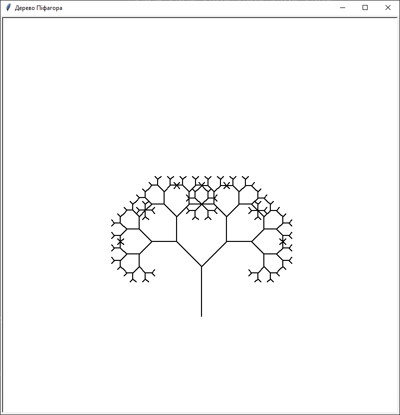
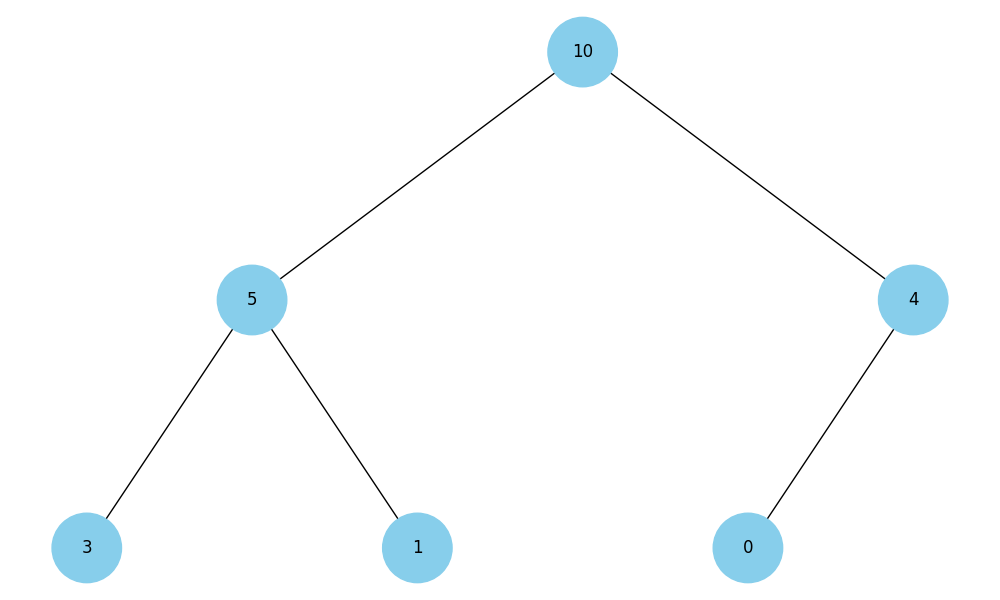
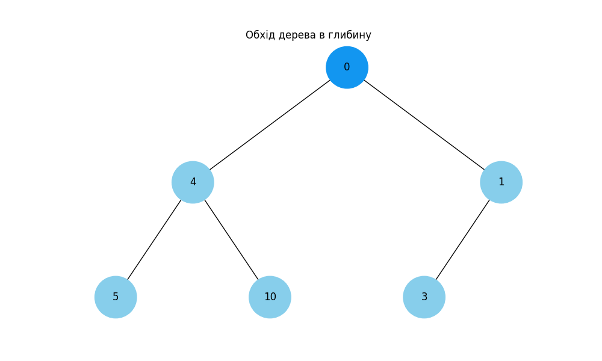
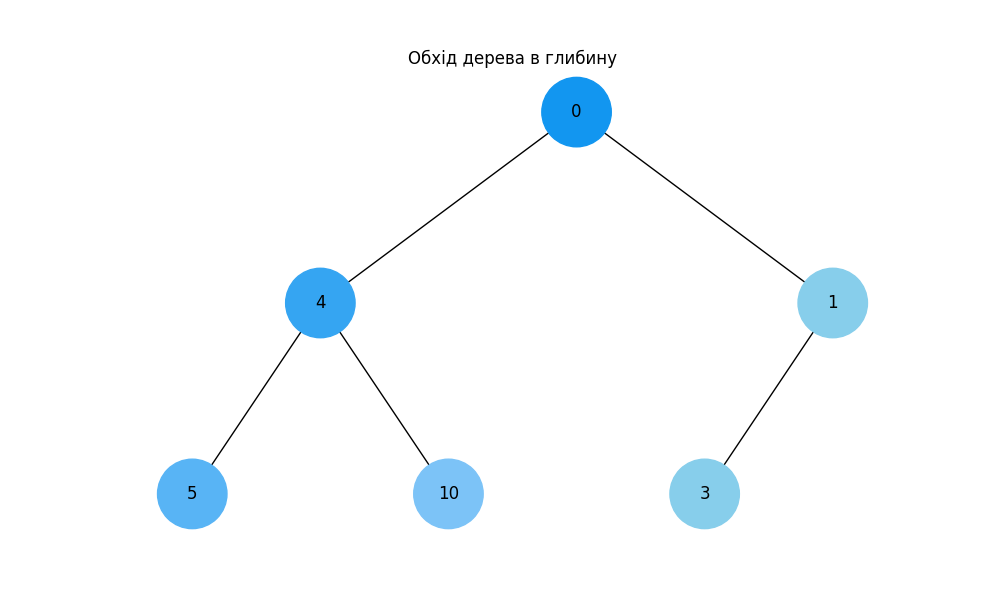
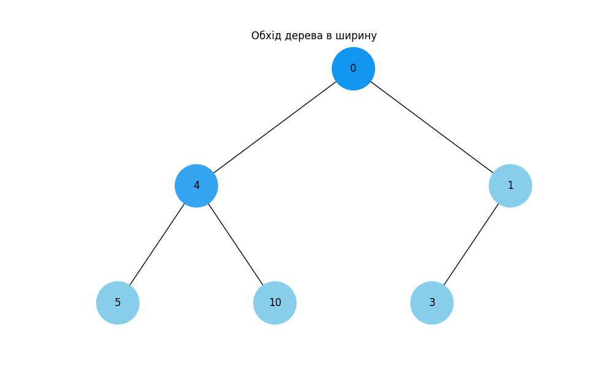
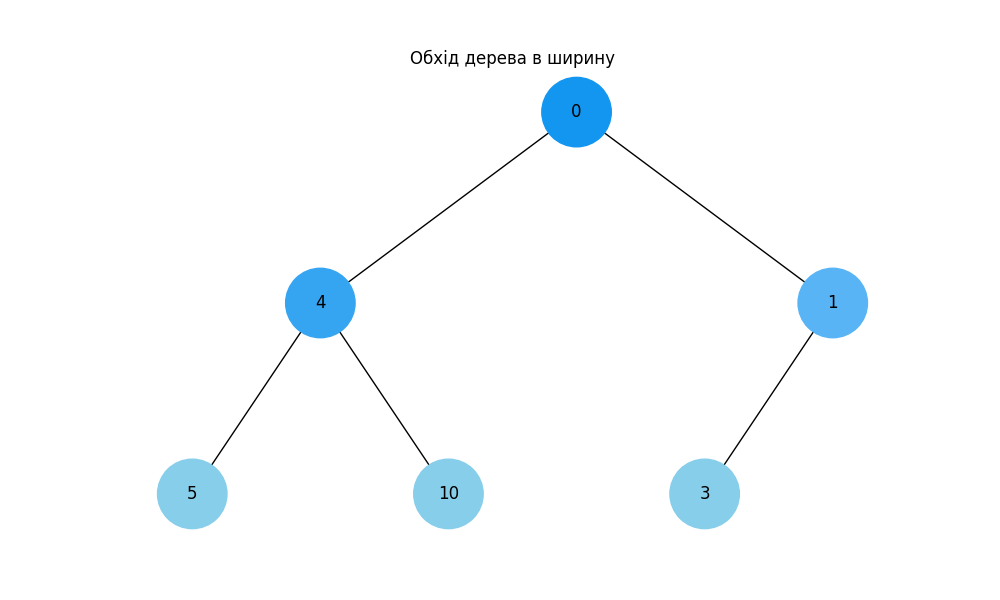
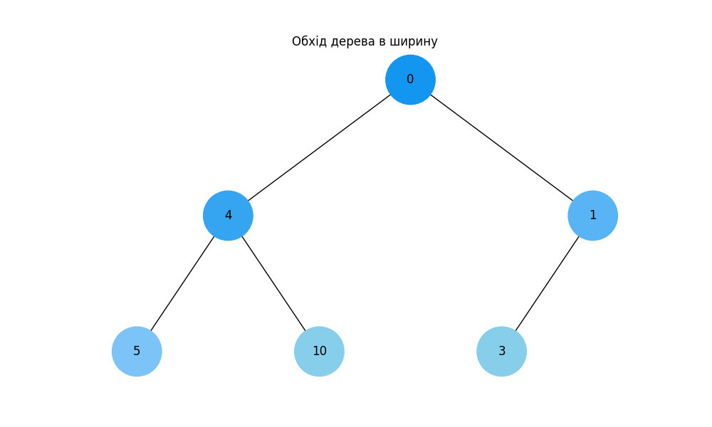
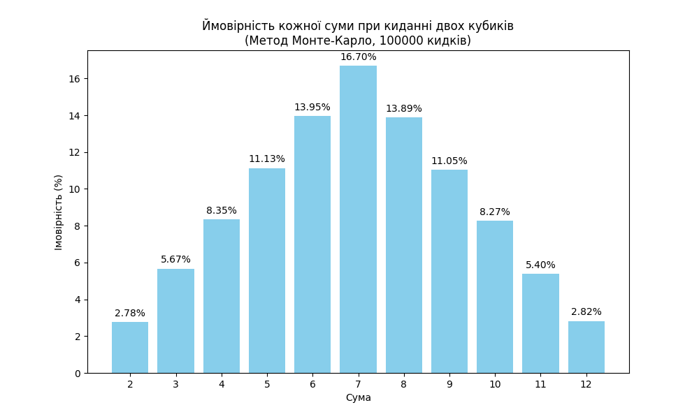

# goit-algo-fp
Final project

**Завдання 1. Структури даних. Сортування. Робота з однозв'язним списком**
======================================================================================
**Тестові результати**
--------------------------------------------------------------------------------------

Заданий список:
15 10 5 20 25 

Реверсований список:
25 20 5 10 15 

Відсортований список (Список 1):
5 10 15 20 25 

Додатковий відсортований список (Список 2):
1 2 3 4 26 27 28 29 30 

Об'єднані списки 1 та 2:
1 2 3 4 5 10 15 20 25 26 27 28 29 30

**************************************************************************************

**Завдання 2. Рекурсія. Створення фрактала "дерево Піфагора" за допомогою рекурсії**
======================================================================================
**Тестовий результат**
--------------------------------------------------------------------------------------

Рівень рекурсії: 8

**************************************************************************************

**Завдання 4. Візуалізація піраміди**
======================================================================================
**Тестовий результат**
--------------------------------------------------------------------------------------

Візуалізація бінарної купи

**************************************************************************************

**Завдання 5. Візуалізація обходу бінарного дерева**
======================================================================================
**Тестовий результат**
--------------------------------------------------------------------------------------

### Обхід дерева в глибину

| Крок 1 | Крок 2 | Крок 3 | Крок 4 |
|--------|--------|--------|--------|
|  |  |  |  |

### Обхід дерева в ширину

| Крок 1 | Крок 2 | Крок 3 | Крок 4 |
|--------|--------|--------|--------|
|  |  |  |  |

**************************************************************************************

**************************************************************************************

**Завдання 5. Візуалізація обходу бінарного дерева**
======================================================================================
**Тестовий результат**
--------------------------------------------------------------------------------------

### Обхід дерева в глибину

| Крок 1 | Крок 2 | Крок 3 | Крок 4 |
|--------|--------|--------|--------|
|  |  |  |  |

### Обхід дерева в ширину

| Крок 1 | Крок 2 | Крок 3 | Крок 4 |
|--------|--------|--------|--------|
|  |  |  |  |

**************************************************************************************

**Завдання 6. Жадібні алгоритми та динамічне програмування**
======================================================================================
**Тестові результати**
--------------------------------------------------------------------------------------

1. **Заданий бюджет: 30**

Жадібний алгоритм:

* Вибрані страви: ['cola', 'pepsi']
* Загальна кількість калорій: 320

Динамічне програмування:

* Вибрані страви: ['potato']
* Загальна кількість калорій: 350

2. **Заданий бюджет: 100**

Жадібний алгоритм:

* Вибрані страви: ['cola', 'potato', 'pepsi', 'hot-dog']
* Загальна кількість калорій: 870

Динамічне програмування:

* Вибрані страви: ['potato', 'cola', 'pepsi', 'pizza']
* Загальна кількість калорій: 970

3. **Заданий бюджет: 139**

Жадібний алгоритм:
* Вибрані страви: ['cola', 'potato', 'pepsi', 'hot-dog', 'hamburger']
* Загальна кількість калорій: 1120

Динамічне програмування:
* Вибрані страви: ['potato', 'cola', 'hot-dog', 'hamburger', 'pizza']
* Загальна кількість калорій: 1320

**************************************************************************************

**Завдання 7. Використання методу Монте-Карло**
======================================================================================
**Тестовий результат**
--------------------------------------------------------------------------------------

| Сума | Аналітична ймовірність (%) | Ймовірність за Монте-Карло (%) |
|------|----------------------------|--------------------------------|
|  2   |           2.78             |             2.78               |
|  3   |           5.56             |             5.67               |
|  4   |           8.33             |             8.35               |
|  5   |           11.11            |             11.13              |
|  6   |           13.89            |             13.95              |
|  7   |           16.67            |             16.70              |
|  8   |           13.89            |             13.89              |
|  9   |           11.11            |             11.05              |
|  10  |           8.33             |             8.27               |
|  11  |           5.56             |             5.40               |
|  12  |           2.78             |             2.82               |

**Висновки**

* Результати, отримані за допомогою методу Монте-Карло, дуже близькі до аналітичних розрахунків ймовірності випадання кожної суми при киданні двох кубиків. Розбіжності між двома наборами даних мінімальні, що свідчить про високу точність методу Монте-Карло в цьому випадку (100000 кидків кубиків).

* Метод Монте-Карло може бути ефективним інструментом для моделювання ймовірностей у широкому спектрі задач.

